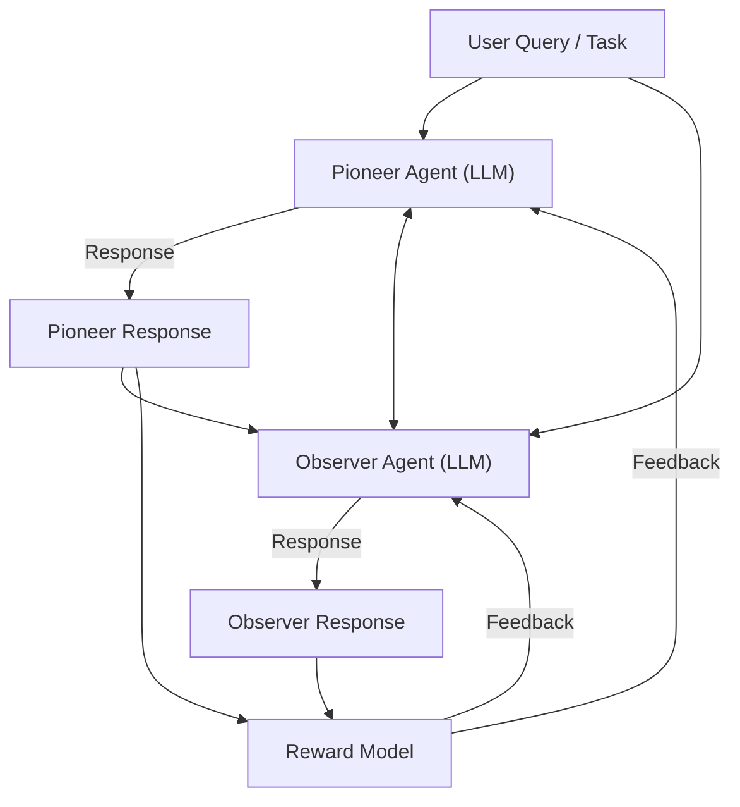

# CORY: Coevolving with the Other You — Fine-Tuning LLM with Sequential Cooperative Multi-Agent Reinforcement Learning

*Figure: CORY architecture with pioneer and observer LLM agents coevolving via sequential cooperative RL and shared feedback.*

**Authors:** Hao Ma, Tianyi Hu, Zhiqiang Pu, Boyin Liu, Xiaolin Ai, Yanyan Liang, Min Chen  
**Conference:** NeurIPS 2024

## Overview
CORY presents a new RL-based fine-tuning method for large language models (LLMs) in a multi-agent setting. The framework leverages sequential cooperative multi-agent reinforcement learning to foster coevolution and emergent capabilities.

## Key Contributions
- Proposes a cooperative RL fine-tuning framework where two LLM agents (pioneer and observer) are trained together.
- The pioneer generates responses to queries; the observer uses both the query and the pioneer’s response to generate its own.
- Agents periodically exchange roles during training, promoting cooperation and coevolution.
- CORY outperforms standard PPO in policy optimality, robustness, and resistance to distribution collapse.

## Methodology
- Sequential cooperative training: agents learn from each other and adapt over time.
- Evaluated on GPT-2 and Llama-2 models with both subjective and objective reward functions (IMDB Review, GSM8K datasets).
- Demonstrates improved training stability and emergent cooperative behaviors.

## Results & Impact
- CORY achieves better performance and robustness than traditional RL fine-tuning methods.
- Highlights the benefits of multi-agent coevolution for LLM fine-tuning.

## Relevance
- Shows the potential of multi-agent RL for improving LLM-based agent systems.
- Suggests new directions for adaptive, cooperative agent training in real-world applications.
