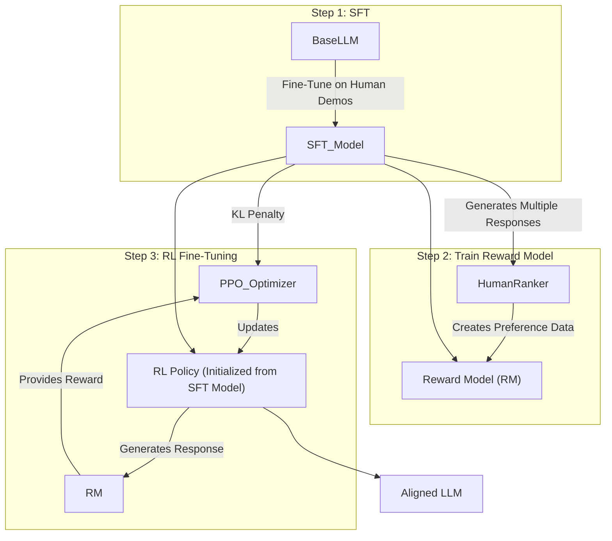

# Detailed Report: "Reinforcement Learning Enhanced LLMs: A Survey"

**Source Paper:** Reinforcement Learning Enhanced LLMs: A Survey (arXiv:2412.10400)

This report provides a detailed breakdown of the concepts discussed in the survey, aimed at providing a deep understanding of how Reinforcement Learning (RL) is used to improve and align Large Language Models (LLMs).

---

## 1. The Core Problem: Why LLMs Need RL

While pre-trained LLMs are incredibly knowledgeable, they are not inherently "aligned" with human goals. Their base objective is simply to predict the next word. This can lead to several issues:

- **Lack of Helpfulness:** They might give technically correct but unhelpful or evasive answers.
- **Toxicity and Bias:** They can reproduce harmful biases or generate toxic content present in their training data.
- **Fabrication ("Hallucination"):** They may confidently state incorrect information.
- **Instruction Following:** They might misunderstand or ignore complex user instructions.

**RL provides a framework to "steer" the LLM's behavior.** Instead of just predicting text, the model learns to generate text that maximizes a "reward," which is designed to represent human preferences.

---

## 2. Key RL Concepts in the LLM Context

- **Agent:** The LLM itself.
- **Environment:** The context of the conversation, including the user's prompt.
- **Action:** The text the LLM generates in response to a prompt.
- **Policy:** The internal mechanism of the LLM that decides which words to output. RL fine-tuning adjusts this policy.
- **Reward:** A numerical score that indicates how "good" the LLM's generated text is. This is the most critical and challenging part of the process.

---

## 3. Reinforcement Learning from Human Feedback (RLHF)

RLHF is the most well-known and foundational technique. It's a three-step process.

### Step 1: Supervised Fine-Tuning (SFT)

- **Goal:** Teach the base LLM the desired style and format for responding.
- **Process:**
    1.  A small, high-quality dataset is created where human labelers write ideal responses to various prompts.
    2.  The pre-trained LLM is fine-tuned on this dataset.
- **Result:** An "SFT model" that is better at following instructions and conversing in the desired style, but still lacks deep alignment.

### Step 2: Training a Reward Model (RM)

- **Goal:** Create a separate model that can automatically score how good any given LLM response is. This RM acts as a proxy for human judgment.
- **Process:**
    1.  Take a prompt and generate several different responses from the SFT model.
    2.  A human labeler ranks these responses from best to worst.
    3.  This creates a dataset of preference pairs (e.g., for a given prompt, `Response A > Response B`, `Response A > Response C`, `Response C > Response B`).
    4.  A separate model (often initialized from the SFT model) is trained on this dataset. Its job is to take a prompt and a response and output a single numerical score (the reward). It learns to give higher scores to the responses humans preferred.

### Step 3: RL Fine-Tuning with Proximal Policy Optimization (PPO)

- **Goal:** Use the Reward Model to fine-tune the SFT model's policy, teaching it to generate responses that score high on the RM.
- **Process:**
    1.  A prompt is given to the SFT model.
    2.  The model generates a response.
    3.  The **Reward Model** scores this response, generating a reward.
    4.  The PPO algorithm uses this reward to update the SFT model's weights.
- **Crucial Detail (The KL Penalty):** A major risk is that the LLM, in its quest for a high reward, might start generating gibberish that happens to fool the RM. To prevent this, PPO adds a **KL-divergence penalty**. This penalty measures how much the model's policy has "diverged" from the original SFT model. It ensures the LLM doesn't forget its language capabilities while chasing the reward.

### RLHF Architecture Diagram

---

## 4. Reinforcement Learning from AI Feedback (RLAIF)

RLAIF is a direct evolution of RLHF, designed to reduce the dependency on expensive and slow human labeling.

- **Core Idea:** Replace the human ranker in Step 2 with a powerful, off-the-shelf "judge" LLM (like GPT-4 or Claude 3 Opus).
- **Process:**
    1.  The SFT model generates multiple responses.
    2.  The "judge" LLM is prompted with a rubric (e.g., "Which response is more helpful, honest, and harmless?") and ranks the responses.
    3.  This AI-generated preference data is then used to train the Reward Model, just as in RLHF.
- **Pros:** Massively scalable, faster, and cheaper.
- **Cons:** The final model's values are limited by the values of the "judge" LLM. Any biases in the judge will be inherited and potentially amplified.

---

## 5. Direct Preference Optimization (DPO)

DPO is a more recent and simpler alternative that cleverly bypasses the need for an explicit Reward Model.

- **Core Idea:** Instead of training a separate model to predict rewards, directly optimize the LLM policy on the preference data itself.
- **How it Works:**
    1.  You still need the preference data (pairs of "chosen" vs. "rejected" responses), which can come from humans or AI.
    2.  DPO uses a specific mathematical formula derived from the same principles as RLHF. This formula allows it to directly calculate how to adjust the policy to increase the likelihood of generating the "chosen" responses and decrease the likelihood of the "rejected" ones.
- **Analogy:** Imagine you're training a dog.
    - **RLHF:** You first teach a friend what a "good trick" looks like (training the RM). Then, the friend watches the dog and gives it treats (rewards) when it does a good trick.
    - **DPO:** You skip the friend. You directly give the dog a treat for the good trick and a "no" for the bad one, directly influencing its behavior.
- **Pros:**
    - **Simpler:** No need to train and host a separate Reward Model.
    - **More Stable:** Avoids the complexity of the nested optimization loops in PPO.
    - **Often More Effective:** Many studies find it produces equivalent or better results with less effort.

---

## 6. Challenges and Future Directions

- **Reward Hacking:** The LLM finds a clever but unintended way to get a high reward (e.g., repeating "I am helpful" over and over). The KL penalty helps, but it's not a perfect solution.
- **Scalability of Feedback:** Getting high-quality human preference data is a major bottleneck. RLAIF helps, but has its own issues.
- **Complex Reasoning:** Current methods are good at style and safety, but struggle to teach complex, multi-step reasoning.
- **Personalization:** How do you align a model to an individual user's preferences, not just a general population's?

This detailed breakdown should provide a solid foundation for understanding the techniques used to align modern LLMs and how you might apply them to your own project.
