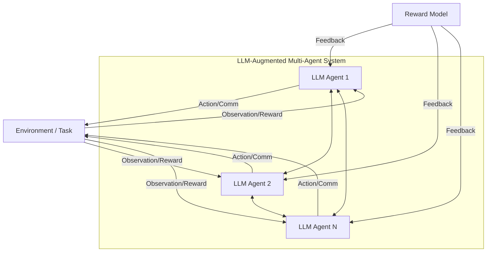

# Enhancing Multi-Agent Systems via Reinforcement Learning with LLM-based Agents

*Figure: LLM-augmented multi-agent RL system with agent communication, environment interaction, and reward feedback.*

**arXiv:** [2503.10049](https://arxiv.org/abs/2503.10049)
**Year:** 2025

## Overview
This paper explores how integrating Large Language Models (LLMs) into multi-agent systems (MAS) can enhance the execution of complex tasks. It focuses on the use of Multi-Agent Reinforcement Learning (MARL) to improve agent collaboration, coordination, and safety, while addressing the challenges of reward design and scalability.

## Key Contributions
- Analyzes the limitations of traditional MARL in handling complex, real-world tasks.
- Demonstrates how LLMs can be leveraged to improve communication, reasoning, and adaptability in MAS.
- Proposes new methods for integrating LLMs into MARL frameworks, including novel reward design and coordination strategies.
- Provides experimental results showing improved performance and safety in LLM-augmented MAS.

## Methodology
- Combines LLMs with MARL agents to enable richer communication and more flexible policy learning.
- Addresses the challenge of designing effective reward functions for complex, multi-agent environments.
- Evaluates the proposed methods on benchmark tasks requiring coordination and safe exploration.

## Results & Impact
- LLM-augmented agents outperform traditional MARL agents in complex, collaborative tasks.
- Improved safety and coordination are observed, with LLMs enabling more robust agent interactions.
- The paper sets a foundation for future research on LLM-enhanced MARL systems.

## Relevance
- Highly relevant for projects aiming to build adaptive, collaborative, and safe multi-agent LLM systems.
- Suggests practical strategies for integrating LLMs into reinforcement learning pipelines for MAS.
