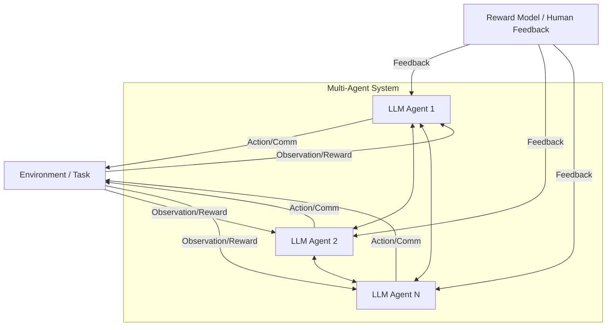

# LLM-based Multi-Agent Reinforcement Learning: Current and Future Directions

*Figure: General architecture for LLM-based multi-agent RL systems with agent communication, environment interaction, and reward feedback.*

**Authors:** Chuanneng Sun, Songjun Huang, Dario Pompili  
**arXiv:** [2405.11106](https://arxiv.org/abs/2405.11106)  
**Year:** 2024

## Overview
This paper surveys the landscape of reinforcement learning (RL) for large language model (LLM)-based agents, with a focus on multi-agent systems (MAS). It discusses the challenges and opportunities in extending RL from single-agent to multi-agent LLM settings.

## Key Contributions
- Reviews existing RL frameworks for both single-agent and multi-agent LLM-based systems.
- Identifies challenges in coordination, communication, and adaptation for multi-agent RL.
- Highlights the importance of cooperative tasks and communication among agents.
- Discusses human-in-the-loop and on-the-loop scenarios enabled by language-based agents.

## Methodology
- Surveys current RL and MARL approaches for LLM agents.
- Analyzes the limitations of current frameworks and suggests research directions.
- Emphasizes the need for new methods to handle coordination and communication in MAS.

## Results & Impact
- Provides a comprehensive overview of the state of the art in LLM-based multi-agent RL.
- Suggests future research directions, including better communication protocols and adaptive learning strategies.

## Relevance
- Useful for understanding the current challenges and opportunities in RL for LLM-based agent systems.
- Informs future development of adaptive, collaborative agent architectures.
