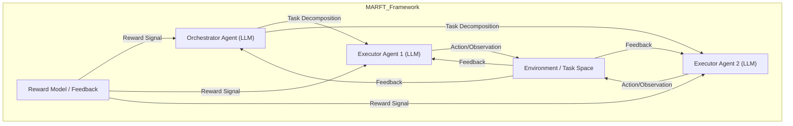

# MARFT: Multi-Agent Reinforcement Fine-Tuning

*Figure: MARFT architecture with orchestrator and executor LLM agents interacting with the environment and reward model for RL-based fine-tuning.*

**Authors:** Junwei Liao, Muning Wen, Jun Wang, Weinan Zhang  
**arXiv:** [2504.16129](https://arxiv.org/abs/2504.16129)  
**Year:** 2025

## Overview
MARFT introduces a novel paradigm for fine-tuning large language model (LLM)-based multi-agent systems using reinforcement learning (RL). The paper addresses the unique challenges of applying RL to language-agent multi-agent systems (LaMAS), such as coordination, communication, and scalability.

## Key Contributions
- Proposes Multi-Agent Reinforcement Fine-Tuning (MARFT), a framework for RL-based fine-tuning of LLM-powered multi-agent systems.
- Introduces Flex-POMDP, a new partially observable Markov decision process tailored for real-world LaMAS optimization.
- Provides a universal algorithmic framework and open-source implementation for MARFT.
- Reviews the evolution from RL to RFT (Reinforcement Fine-Tuning) and extends it to the multi-agent domain.
- Details the differences between traditional multi-agent RL (MARL) and MARFT, motivating a LaMAS-oriented approach.

## Methodology
- MARFT leverages RL to adapt and improve agent behaviors through interaction and feedback.
- The Flex-POMDP formulation allows for flexible, scalable optimization in complex, real-world agentic systems.
- The framework is designed to be robust and scalable, with practical implementation strategies provided.

## Results & Impact
- MARFT demonstrates improved adaptability and resilience in LLM-based multi-agent systems.
- The open-source implementation facilitates adoption and further research.
- The paper serves as a roadmap for advancing RL-based fine-tuning in agentic systems.

## Relevance
- Directly applicable to projects seeking to make agents more adaptive and robust through RL-based fine-tuning.
- Highlights the importance of moving beyond static agent logic to dynamic, learning-based approaches.
