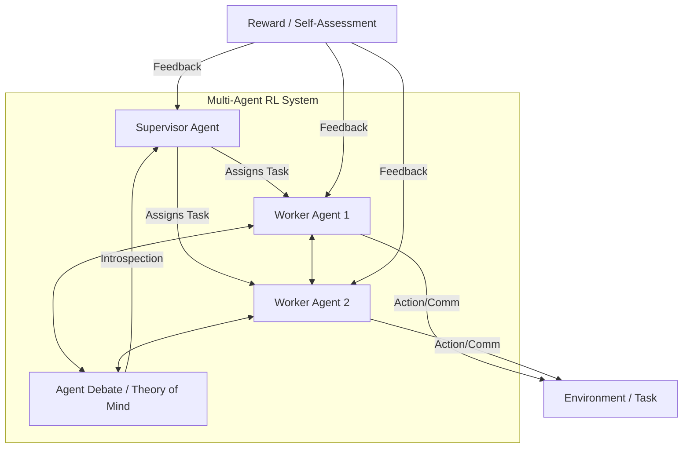

# Meta-Thinking in LLMs via Multi-Agent Reinforcement Learning: A Survey

*Figure: Meta-thinking in LLMs via MARL, with supervisor, worker agents, debate, and self-assessment feedback.*

**Authors:** Ahsan Bilal, Muhammad Ahmed Mohsin, Muhammad Umer, Muhammad Awais Khan Bangash, Muhammad Ali Jamshed  
**arXiv:** [2504.14520](https://arxiv.org/abs/2504.14520)  
**Year:** 2025

## Overview
This survey explores the development of meta-thinking (self-reflection, assessment, and control of thinking processes) in LLMs from a Multi-Agent Reinforcement Learning (MARL) perspective. It discusses how multi-agent architectures can enhance LLM reliability, flexibility, and performance, especially for complex or high-stakes tasks.

## Key Contributions
- Analyzes current LLM limitations, such as hallucinations and lack of self-assessment.
- Reviews methods like RL from human feedback (RLHF), self-distillation, and chain-of-thought prompting.
- Explores multi-agent architectures: supervisor-agent hierarchies, agent debates, and theory of mind frameworks.
- Discusses reward mechanisms, self-play, and continuous learning in MARL for introspective, adaptive LLMs.
- Outlines evaluation metrics, datasets, and neuroscience-inspired architectures for future research.

## Methodology
- Surveys recent advances in meta-thinking and introspection for LLMs using MARL.
- Reviews hybrid symbolic reasoning and continuous learning methods.
- Provides a roadmap for building trustworthy, adaptive LLMs.

## Results & Impact
- Highlights the potential of multi-agent and meta-cognitive approaches for robust LLMs.
- Identifies open challenges and future research avenues in introspective agent design.

## Relevance
- Important for those developing reliable, self-assessing, and adaptive LLM-based agent systems.
- Informs the design of next-generation LLMs with meta-cognitive capabilities.
