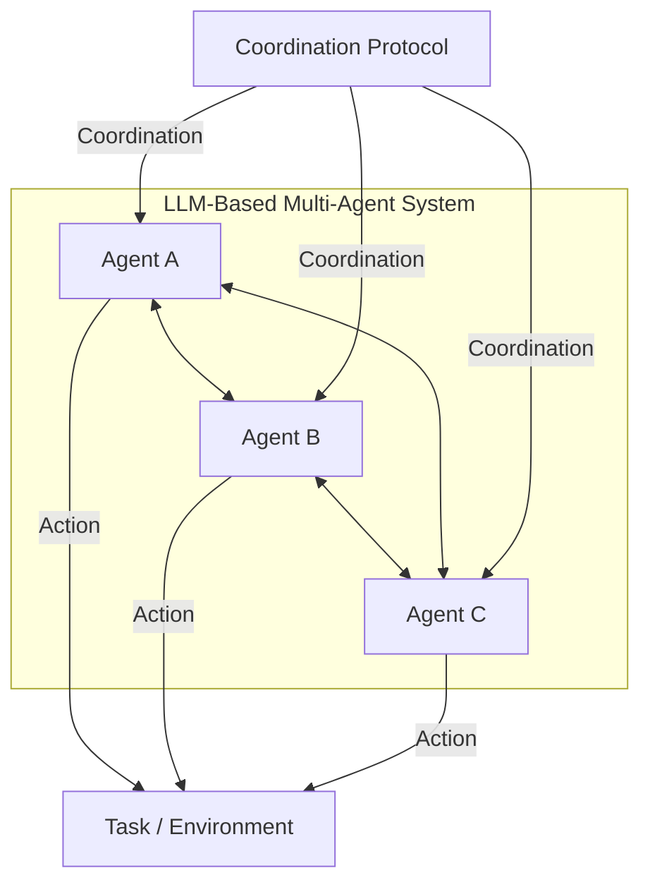

# Multi-Agent Collaboration Mechanisms: A Survey of LLMs

*Figure: Collaboration mechanisms in LLM-based MAS, showing agent communication, coordination protocols, and task interaction.*

**Authors:** Khanh-Tung Tran, Dung Dao, Minh-Duong Nguyen, Quoc-Viet Pham, Barry O'Sullivan, Hoang D. Nguyen  
**arXiv:** [2501.06322](https://arxiv.org/abs/2501.06322)  
**Year:** 2025

## Overview
This survey reviews the collaborative aspects of LLM-based multi-agent systems (MASs), focusing on how groups of intelligent agents coordinate and solve complex tasks collectively. It introduces a framework for characterizing collaboration mechanisms and reviews methodologies, applications, and open challenges in the field.

## Key Contributions
- Provides an extensive survey of collaboration in LLM-based MASs, including cooperation, competition, and hybrid approaches.
- Introduces a framework to classify collaboration mechanisms by actors, types, structures, strategies, and coordination protocols.
- Reviews real-world applications across domains such as networks, industry, question answering, and social settings.
- Identifies key lessons, open challenges, and future research directions for artificial collective intelligence.

## Methodology
- Analyzes collaboration structures (peer-to-peer, centralized, distributed) and strategies (role-based, model-based).
- Reviews coordination protocols and their effectiveness in real-world MAS applications.
- Surveys the adoption and impact of MASs in diverse domains.

## Results & Impact
- Lays a foundation for advancing LLM-based MASs toward more intelligent and collaborative solutions.
- Highlights the transition from isolated models to collaboration-centric approaches.

## Relevance
- Highly relevant for researchers and developers building collaborative, scalable, and intelligent multi-agent LLM systems.
- Informs the design of future MAS architectures and protocols.
