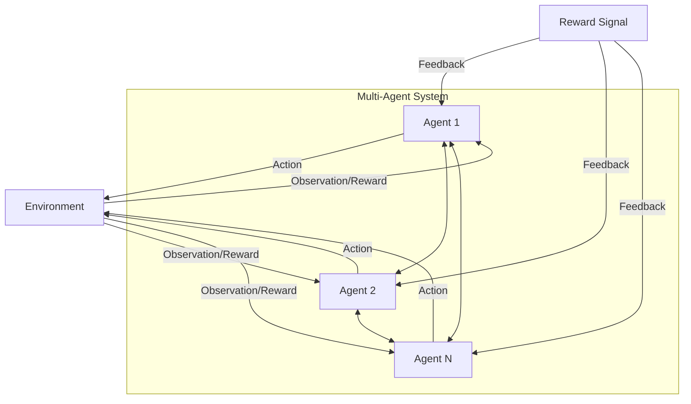

# Multi-agent Reinforcement Learning: A Comprehensive Survey

*Figure: General MARL architecture with multiple agents interacting with the environment and each other, receiving reward signals.*

**Authors:** Dom Huh, Prasant Mohapatra  
**arXiv:** [2312.10256](https://arxiv.org/abs/2312.10256)  
**Year:** 2023

## Overview
This comprehensive survey examines the challenges and opportunities in multi-agent reinforcement learning (MARL), connecting concepts from game theory and machine learning to recent MARL advancements. It provides a broad perspective on data-driven decision-making in multi-agent systems (MAS).

## Key Contributions
- Reviews seminal concepts from game theory and machine learning as applied to MARL.
- Analyzes the current landscape of MARL, including applications, limitations, and solutions.
- Highlights the unique opportunities and challenges in MARL, such as coordination, scalability, and reward design.
- Motivates future research directions for deeper integration of related domains.

## Methodology
- Surveys past and recent efforts in MARL and related fields.
- Describes prior solutions, their limitations, and their applications in real-world MAS.
- Connects MARL research to broader AI and ML trends.

## Results & Impact
- Provides a detailed exploration of MARL's evolution and current state.
- Offers insights for advancing MARL research and applications.

## Relevance
- Essential reading for anyone interested in the theory and practice of MARL.
- Informs the development of robust, scalable, and intelligent multi-agent systems.
