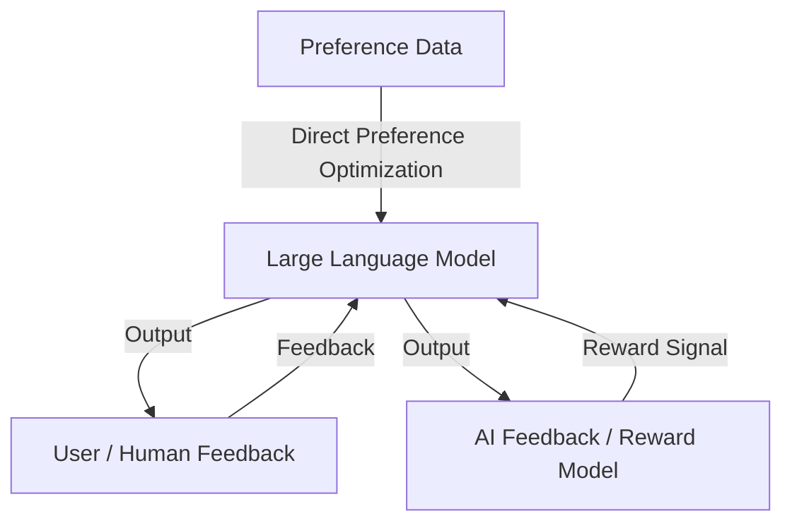

# Reinforcement Learning Enhanced LLMs: A Survey

*Figure: RL-enhanced LLMs architecture showing feedback from users, AI, and preference data for model alignment.*

**Authors:** Shuhe Wang, Shengyu Zhang, Jie Zhang, Runyi Hu, Xiaoya Li, Tianwei Zhang, Jiwei Li, Fei Wu, Guoyin Wang, Eduard Hovy  
**arXiv:** [2412.10400](https://arxiv.org/abs/2412.10400)  
**Year:** 2024

## Overview
This survey provides a systematic review of the state of RL-enhanced large language models (LLMs), including foundational concepts, popular RL-enhanced LLMs, and widely-used reward model-based RL techniques. It addresses the complexity of implementing RL in LLMs and consolidates recent research to help researchers understand current challenges and advancements.

## Key Contributions
- Details the basics of reinforcement learning and its application to LLMs.
- Reviews RL-enhanced LLMs, including DeepSeek-R1 and others.
- Covers two main RL techniques: Reinforcement Learning from Human Feedback (RLHF) and Reinforcement Learning from AI Feedback (RLAIF).
- Explores Direct Preference Optimization (DPO) as an alternative to reward models.
- Identifies current challenges and deficiencies in RL-enhanced LLMs and suggests avenues for improvement.

## Methodology
- Surveys RL algorithms, reward modeling strategies, and optimization techniques for LLMs.
- Analyzes the effectiveness and limitations of RLHF, RLAIF, and DPO.
- Provides a project page for further resources and updates.

## Results & Impact
- Summarizes the rapid progress in RL-enhanced LLMs and highlights the need for systematic understanding.
- Points out open challenges in reward modeling, optimization, and alignment with human preferences.

## Relevance
- Essential reading for researchers and practitioners working on RL-enhanced LLMs.
- Informs future research directions and practical implementations in the field.
